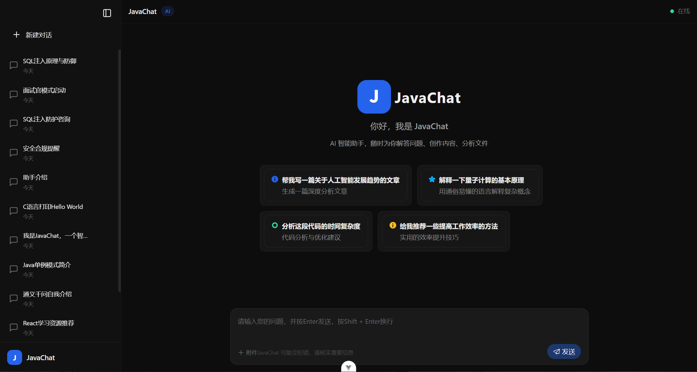

# JavaChat

> 一个用于练习 Spring AI 的前后端分离 Chat Web 项目，使用Qwen-MAX模型API。支持基础对话、流式输出、会话/消息管理等能力（MVP）。

> 这里是JavaChat的前端项目，后端项目请移步 [JavaChat-Server](https://github.com/607163943/JavaChat-Server)。
---

## ✨ 功能特性（MVP）

- [x] 会话创建 / 列表 / 切换
- [x] 消息发送与展示（User / Assistant）
- [x] 流式响应（SSE / Streaming）
- [x] 会话上下文（基于 ChatMemory / MessageChatMemoryAdvisor）
- [x] 消息持久化（MySQL）
- [x] API 文档（Knife4j）

---

## 🧱 技术栈

### 后端

- SpringBoot 3.5.10
- Spring AI Alibaba 1.1.2.0
- MyBatisPlus 3.5.15
- Knife4j 4.4.0
- Hutool-all 5.8.40

### 前端

- Vite 7.3.1
- Vue 3.5.27
- Pinia 3.0.4
- Axios 1.13.5
- TypeScript
- MateChat 1.11.1

---

## 🚀 快速开始

### 1) 环境要求
- Node：22.13.1
------

### 2) 前端启动（web）

```
pnpm i
pnpm dev
```

访问（按你实际端口替换）：

- `http://localhost:5173`

------

## 📸 截图

- Chat 页面




------

## 🤝 贡献

欢迎提 Issue / PR。

------

## 📄 License

MIT（或按你仓库实际填写）